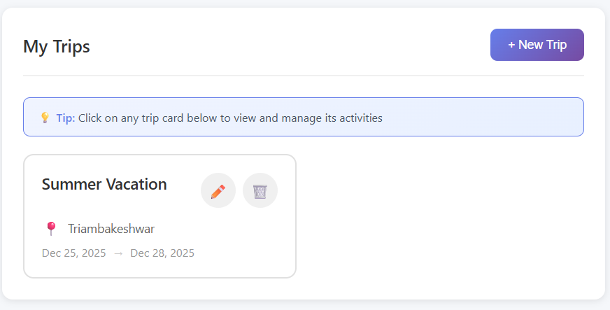

# 🌍 GlobeTrotter — Intelligent Travel Planner
*A full-stack, database-driven travel planning platform built for the Odoo Hackathon.*

GlobeTrotter helps users plan, organize, and manage their trips effortlessly. It combines a robust Node.js/Express backend with a modern React frontend to provide a seamless travel planning experience.

---

## 🎯 Why This Project Stands Out

*   **Fully Dynamic & Database-Driven:** No mock data; everything persists in PostgreSQL.
*   **Strong Backend Architecture:** Clean REST API design with solid SQL aggregation logic.
*   **Secure:** Proper authentication (JWT + bcrypt) and data isolation.
*   **Production-Ready Features:** Password hashing, image uploads, and input validation.

---

## 🚀 Key Features

### 1. **User Authentication & Security**
*   **Secure Signup & Login:** BCrypt password hashing and JWT stateless authentication.
*   **Protected Routes:** Middleware ensures only authenticated users access private data.

### 2. **Comprehensive Profile Management**
*   **Profile Customization:** Update Name, Email, and preferences (Language, Currency).
*   **Avatar Upload:** **[NEW]** Direct image upload support using `multer` with static file serving.
*   **Password Security:** **[NEW]** Secure "Change Password" feature with current password verification.
*   **Account Deletion:** Full account removal for data privacy.

### 3. **Trip Planning**
*   **Trip Management:** Create, view, update, delete trips.
*   **Smart Itineraries:** Visualize daily plans based on destination and dates.
*   **Budget Tracking:** Monitor trip costs effectively.

### 4. **Activity Scheduling**
*   **Dynamic Activities:** Add specific activities to trips with location and cost details.
*   **Real-time Updates:** Changes reflect immediately across the dashboard.

---

## 🖼️ Screenshots

| Login & Signup | Dashboard |
|---------------|-----------|
|  |  |

| Trips | Itinerary |
|------|-----------|
|  |  |

---

## 🛠️ Technology Stack

### Backend
*   **Runtime:** [Node.js](https://nodejs.org/)
*   **Framework:** [Express.js](https://expressjs.com/)
*   **Database:** [PostgreSQL](https://www.postgresql.org/)
*   **Authentication:** `jsonwebtoken` (JWT)
*   **Security:** `bcryptjs` (Hashing), `cors` (CORS)
*   **File Upload:** `multer`
*   **Validation:** `express-validator`

### Frontend
*   **Framework:** [React](https://react.dev/)
*   **Build Tool:** [Vite](https://vitejs.dev/)
*   **Routing:** `react-router-dom`
*   **HTTP Client:** `axios`
*   **Styling:** Custom CSS with responsive design

---

## ⚙️ Installation & Setup

### Prerequisites
*   Node.js (v18+ recommended)
*   PostgreSQL installed and running

### 1. Database Setup
Create a PostgreSQL database named `travel_planner`:
```sql
CREATE DATABASE travel_planner;
```
*Note: The application will automatically create necessary tables on the first run.*

### 2. Backend Setup
Navigate to the root directory:
```bash
# Install dependencies
npm install

# Start the server (runs on port 3000)
npm run dev
```

### 3. Frontend Setup
Open a new terminal and navigate to the `frontend` folder:
```bash
cd frontend

# Install dependencies
npm install

# Start the development server (runs on port 5173)
npm run dev
```

---

## 📡 API Documentation

### Authentication
*   `POST /api/auth/signup` - Register a new user
*   `POST /api/auth/login` - Login user
*   `GET /api/auth/me` - Get current user info

### Profile
*   `GET /api/auth/profile` - Get full profile details
*   `PUT /api/auth/profile` - Update profile info
*   `PUT /api/auth/change-password` - Change password
*   `DELETE /api/auth/profile` - Delete account

### Uploads
*   `POST /api/upload` - Upload an image file (returns URL)

### Trips
*   `GET /api/trips` - Get all trips
*   `POST /api/trips` - Create a trip
*   `GET /api/trips/:id` - Get trip details
*   `PUT /api/trips/:id` - Update trip
*   `DELETE /api/trips/:id` - Delete trip

### Activities
*   `GET /api/trips/:id/activities` - Get activities for a trip
*   `POST /api/trips/:id/activities` - Add an activity

---

## 📂 Project Structure

```
Odoo-Globe-Trotter/
├── config/             # Database configuration
├── controllers/        # Request handlers (business logic)
├── middleware/         # Auth, validation, error handling
├── routes/             # API route definitions
├── services/           # Database interaction layer
├── uploads/            # Stored user uploaded images
├── utils/              # Helper functions (JWT, Hashing)
├── frontend/           # React Frontend Application
│   ├── src/
│   │   ├── components/ # Reusable UI components
│   │   ├── context/    # Global state (Auth)
│   │   ├── pages/      # Page components
│   │   ├── services/   # API client services
│   │   └── ...
│   └── ...
├── app.js             # Express app setup
└── server.js          # API entry point
```

---

## 🤝 Contributing
1.  Fork the repository
2.  Create your feature branch (`git checkout -b feature/NewFeature`)
3.  Commit your changes (`git commit -m 'Add some NewFeature'`)
4.  Push to the branch (`git push origin feature/NewFeature`)
5.  Open a Pull Request
